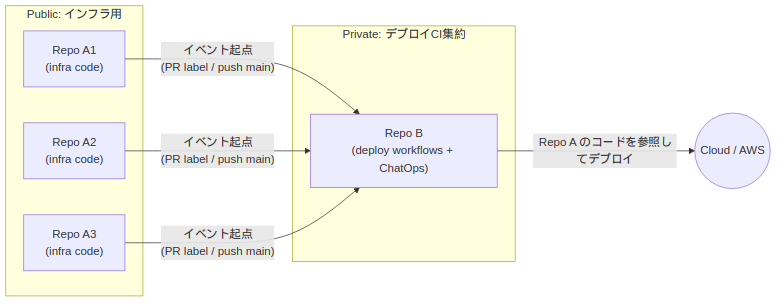
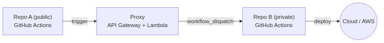

AWSのようなパブリッククラウドのコードを扱っていると、インフラのコードとデプロイ用のコードを分離したくなる時があります。
そうした、"リポジトリが2つあってイベントをトリガーしたい時のパターン"を考えてみました。

# 分離したいモチベーション

- モチベ 1: インフラ用のコードを公開したいが、デプロイするCIは公開したくない
  - 学習記録としてインフラ用のコードを公開したい
  - ChatOpsでデプロイする検討をしていたが、public repositoryでChatOpsをするのはセキュリティ的に怖い
  - 将来的にChatOpsにAIを組み込みたいので、やっぱりpublic repositoryでChatOpsはしたくない
- モチベ 2: publicにするリポジトリからトリガーできるCIのシークレットは最小限の権限にしたい
  - 作りたいもの、で後述するようにPRからのデプロイCIトリガーができるため
  - もちろん、"Require approval for all external contributors"は有効にする

モチベ 1の公開したいものと公開したくないものを分離するのは、結局「パブリックコードと、デプロイトリガーできるプライベートチャットの分離」をしたいということです。
チャットはSlackやdiscordであっても大丈夫ですが、今回はGitHubリポジトリを分離し、issue comment等でChatOpsすることにしました。
以降、「インフラのコードリポジトリA」と「デプロイCI用のリポジトリB」を分けて考えます。デプロイCI用のリポジトリBはprivate repositoryひとつにしておいて、インフラのコードリポジトリAは複数個あるイメージです。デプロイCIだけ集約しているイメージです。

この時、インフラのコードリポジトリAからCIをトリガーしたい時はどうすればいいでしょうか。トリガーの主体をCODEOWNERS内のユーザーに限定するフィルタ処理を書けば、公開リポジトリからのトリガーであっても安全にできます。

このように、「リポジトリAからリポジトリBのGitHub Actionsをトリガーしたい」というケースについて考えてみました。

# 作りたいもの

やりたいことを整理します。

- リポジトリAはpublic repository
- リポジトリBはprivate repository
- リポジトリBからリポジトリAのコードをデプロイするには、3つ方法がある
  - リポジトリBでChatOps(issue commentでリポジトリとブランチを指定してデプロイ)
  - リポジトリAで、PRに特定のラベルをつける([ラベルはTriage権限を持つ人しかつけられない](https://docs.github.com/en/issues/using-labels-and-milestones-to-track-work/managing-labels#applying-a-label)ので安全)
  - リポジトリAで、mainブランチにマージする(mainブランチにマージできる人を制限すれば安全)



# リポジトリ間でイベントをトリガーするパターン

## パターン1: リポジトリBの権限をリポジトリAに渡す

この方法では、リポジトリBのGitHub Actionsを直接トリガーする権限をリポジトリAに渡します。例えば、GitHub AppやPersonal Access Token(PAT)を用いて `workflow_dispatch` イベントを叩く、というような方法を想定しています。(参考: [`workflow_dispatch` のGitHub Docs](https://docs.github.com/en/rest/actions/workflows?apiVersion=2022-11-28#create-a-workflow-dispatch-event--fine-grained-access-tokens))
モチベ 2に沿うと、今回の権限は「リポジトリBのCIをworkflow_dispatchでトリガーする権限」に当たります。これはActions repository permissionのwrite権限に当たります。

## パターン2: リポジトリAのイベントを何かでproxyしてリポジトリBに渡す

パターン1より権限を絞ることはできないでしょうか。思いついたものとして、リポジトリAとリポジトリBの間になんらかのproxyを置く方法です。
proxyはリポジトリAのイベントを受け取り、トリガーした主体がCODEOWNERS内のユーザーであればリポジトリBのGitHub Actionsをトリガーする、というような動きをします。
こうすることで、リポジトリAに与える権限を「proxyをトリガーできる」だけに絞ることが可能になります。

まず、proxyの入力部分であるイベントの受け取りについて考えます。

## パターン2.1: webhookを利用する

イベントをリポジトリAからproxyに渡す方法として、まずwebhookを利用する方法が考えられます。
方法は2つ思いつきました。

- Repository webhookを利用する
- GitHub Appを利用して、webhookを受け取る

(参考) [Creating webhooks - GitHub Docs](https://docs.github.com/en/webhooks/using-webhooks/creating-webhooks)

これらはどちらも、どのイベントでwebhookを飛ばすか選択できます。今回はPRへのlabelの付与とmainブランチへのpushに限定したいです。
相当するものはそれぞれ"Pull requests"と"Pushes"になります。しかし、"Pull requests"イベントはPRのオープンでも発火したり、"Pushes"イベントはmainブランチ以外へのpushでも発火します。
今回はデプロイのCIなので頻度は低いことが期待されます。できればproxyの処理をたくさん起動したくないので、今回はwebhookを利用するのは諦めました。
ただ、webhookを利用する方法はコンピューティングリソースの使用なしにイベントを飛ばせる点で優秀なので、たくさんwebhookを受け取りたい場面では有用だと思います。

## パターン2.2: GitHub Actionsを利用する

イベントが少なく、限定される場合はGitHub Actionsを利用してproxyを叩くのが良さそうです。
例えば、パターン2.1で述べたPRへのlabelの付与とmainブランチへのpushは以下のように限定できます

```yaml
on:
  pull_request:
    types: [labeled]
  push:
    branches: [main]
```

(※ただし、対象のラベル以外のラベル付与でも発火する)

続いて、proxyの処理をどこでするかを検討します。

## パターン2.2.1: AWS Lambdaでproxyを実装する

AWS Lambdaと書いたのはAPI Gateway + Lambdaのような、ゲートウェイとサーバレスコンピューティングリソースの組み合わせくらいの意味合いです。
Lambdaでproxyの処理を実装します。proxyではリポジトリBのCODEOWNERS情報とリポジトリBのActions permissions write相当の権限を持っておいて、ユーザーのフィルタと、正しいユーザーならリポジトリBのGitHub Actionsをトリガーするようにします。



## パターン2.2.2: GitHub Actionsでproxyを実装する

こちらはLambdaの代わりにリポジトリBのGitHub Actionsを使います。ただ、これだと結局リポジトリBのActions permissions write相当の権限をリポジトリAで保管するので、モチベ2的に嬉しくないです。

# 検討結果

検討した結果、パターン1、もしくはパターン2.2.1が良さそうです。今回はパターン2.2.1を試してみたいこともあってそちらを採用しました。

# まとめ

今回は限定されたイベントをリポジトリ間でトリガーしたかったので、GitHub Actionsでトリガーの条件を絞り込むことにしました。
また、リポジトリ間のイベント受け渡しする際に、間にproxyを置く方法を考えてみました。
