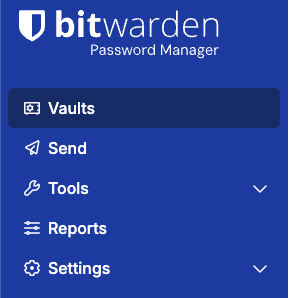
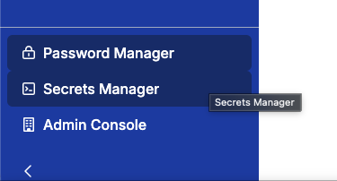
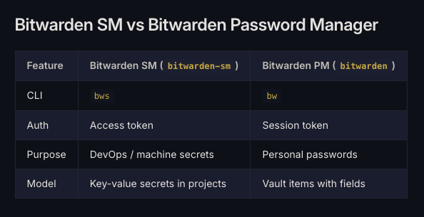

1Password CLIのように、Bitwarden CLIはあるのかなと思って調べたら2つあったので違いをメモします。

BitwardenのCLIと言った時、 `bw` と `bws` の2つがあります。それぞれの違いを理解するために、まずBitwardenの扱うサービスの違いを理解します。

# Bitwarden Password Manager と、 Bitwarden Secrets Manager の違い

## Bitwarden Password Manager

BitwardenをFree Planで利用するときに最初に出てくるのが[Bitwarden Password Manager](https://bitwarden.com/help/password-manager-overview/)です。
以下のように、左上のbitwardenロゴの下に "Password Manager" と書いてある画面です。



これは人間がパスワードを管理するためのサービスです。

## Bitwarden Secrets Manager

Bitwardenの左下のタブから、"Secrets Manager" を選択して始められるのが[Bitwarden Secrets Manager](https://bitwarden.com/help/secrets-manager-overview/)です。Password Managerと違って、明示的に開始する必要があります。Free Planから利用できます。
以下のように、開始した後は左下のタブから切り替えることができます。



これはDevOpsなど、CIやマシンアカウントで使うことを想定されたサービスです。

# `bw` と `bws` の違い

ここまで来ると、 `bw` と `bws` の違いは簡単です。

- `bw` はBitwarden Password Managerを操作するためのCLI
- `bws` はBitwarden Secrets Managerを操作するためのCLI

mise(aqua registry backend)で以下のようにインストールできます。

```console
# bw
$ mise use 'aqua:bitwarden/clients@latest' --pin

# bws
$ mise use 'aqua:bitwarden/sdk-sm@latest' --pin
```

miseのドキュメントの `bw` と `bws` の違いが分かりやすかったので引用します



*画像の引用元: [https://fnox.jdx.dev/providers/bitwarden-sm.html#bitwarden-sm-vs-bitwarden-password-manager](https://fnox.jdx.dev/providers/bitwarden-sm.html#bitwarden-sm-vs-bitwarden-password-manager)*
