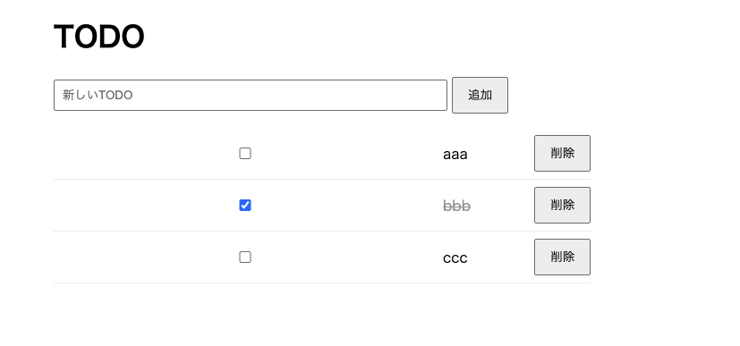
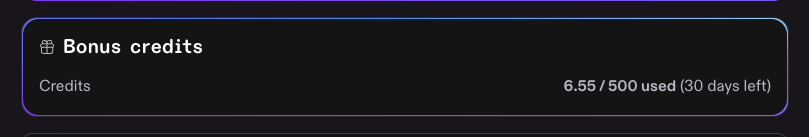
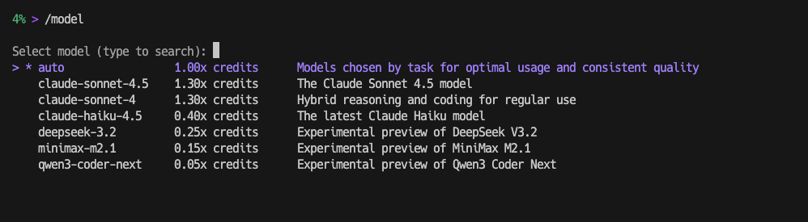

[JAWS-UG朝会 #79 に参加したよ](https://chotto.uta8a.net/note/2026-03-14-jaws-ug-asa-79/) に書いたようにKiro CLIに興味が出たので触ってみました。

# インストール前に確認

- 課金体系
  - [公式ページ](https://kiro.dev/pricing/) を読むと、現時点でFreeプランが存在していて50クレジット/月です
  - その上がProの$20のようです。
  - 最初に使い始めると初めの月だけ500クレジットもらえます(僕ももらえた)。30日すぎると無くなって50クレジット/月に移行するようなので、なんとなく使い始めるよりも、検証したいことがはっきり決まって使い始めた方がいいかも
- インストール方法
  - 僕はUbuntu server上で使うので[mise](https://mise.jdx.dev/)経由で行けないか考えましたが、無理そうでした
  - そのため今回はdevcontainerを作ってその中でKiro CLIを使います

# 使ってみた

devcontainer等の設定はこちら: [try-kiro-cli-on-docker](https://github.com/uta8a/playground/tree/8b9a0e5db14e220a6f6a00ebc0e8f2be9efd95f6/try-kiro-cli-on-docker)

多分試すとmiseのエラーが出るのですが、以下を打てば良いです。(miseはnode, aws-cliの管理で使ってます)

```console
mise trust
mise install
```

- まず何もMCP等の設定を入れずにCDKを使ったアプリケーションを書いてもらう
  - ChatGPTで[仕様書](https://github.com/uta8a/playground/blob/8b9a0e5db14e220a6f6a00ebc0e8f2be9efd95f6/try-kiro-cli-on-docker/docs/plan/1-example-app.old.md)を書いて、Kiro CLIに渡す
  - 要件としては、サーバレスでTodoアプリ(認証なし)を作ってもらう。cdk destroyでリソースが全部消えるようにしてもらう
  - 結果: 結構いい感じのができる。が、デプロイは失敗する

この時点での改善点として以下の2点がありました。

- 命名やタグ付けが微妙
- デプロイが失敗する
  - logGroupが先に作られて、そのあとでLambdaが作られて、その時LogGroupが作成されるが名前が被っているので失敗する

そこで以下を行います

- `.kiro/hooks/name-and-tag.kiro.hook` というJSONファイルを作り、そこに命名とかの話を書く
  - [hooks](https://kiro.dev/docs/cli/hooks/) はClaude Codeで言うところのhooksに近いです。イベント起点でpromptを注入できるやつ。
- エラー文を `docs/plan/ignore-hoge.md` みたいな感じで渡して参照させて、修正案を作ってもらう
  - 結局 `logGroup` をCDKのLambdaで指定する、という正解には辿り着けず、人間が手で直しました

デプロイが成功

- 実質認証なしでDynamoDBをいじれるので、一瞬デプロイして動作確認したらすぐ消しました(削除済み)
- 実際CDKでよく残るS3, Cloudwatch LogsのLogGroupといったものは消えていました。(CDK由来で消えないものを除く)



これで 6.55 クレジット消費。Freeだと平均して1.66クレジット/日なので4日分くらい？



# 感想

- 結局MCP設定までいけなかった。[JAWS-UG 朝会の資料](https://speakerdeck.com/kentapapa/mao-demowakarukiro-cli-ai-qu-dong-kai-fa-henodao-bian?slide=36) のおすすめMCP設定はまた今度
- KiroにAWSに関するAgent Skillsを作成してもらうのは筋がよさそう
  - CDKの書き方とか
  - AWSの資格勉強時に助けてもらうのに役立つSkillsをKiro CLIに作らせるとか
- AWSのエラーをdocs/planのような一時的なplanファイルに書くときはgit commitしないように気をつけたい
  - account idとか載ったりするのは気分がよくない
  - `ignore-*.md` をgitignoreするようにしてる
- 今回はmodelがautoだったのですが、qwen3系とかだともっとクレジット消費が小さいようでした。どれくらい賢いか気になる



- 体感ですが、Codexと比較してCodexの方が賢いと思いました。ただ、Planファイルを作って渡せばそれなりのCDKが上がってくるのはいいですね。直に1ファイルに書くとかしないでデフォルトで何も入れなくてもConstructとか分けてきたのはAWS CDKへの強さを感じました
- Kiroで使えるのはAgent Skills, hooks, steeringの3つが気になりました。steeringはコード規約みたいなのを入れるところっぽいです(チャットで繰り返し言うようなことをまとめておく場所)

次はAWSの勉強にKiro CLIを使ってみたいです。問題作ってもらったり、CDKを書いたらベストプラクティスに沿っているか、未設定のプロパティについて教えてくれたりレビューしてくれたりとかしたら嬉しいな。
